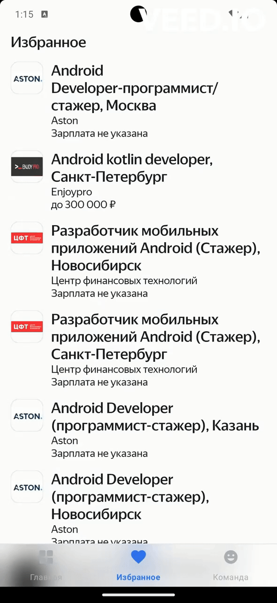

# Take Your Job
## Diploma project at Yandex.Practicum course


[](https://kotlinlang.org)
[](https://dagger.dev/hilt/)

TakeYourJob app is using [HeadHunter API](https://dev.hh.ru/) <br>
The app is created as diploma project.<br>
Implemented options for searching for vacancies (with a custom filters by location, industry, salary), collect/remove vacancies from favorites, view details of an individual vacancy, change the application theme
<br>
### Stack: 
- [Android Studio](https://developer.android.com/studio/intro)
- Coroutines + Flow
- Arcitecture: MVVM+StateFlow, Single Activity + Android Navigation
- DB: Room Persistent Library
- Network: Retrofit2
- DI - Hilt
- Coil
- WebView

## Screencast 

[](https://youtu.be/_3nTWs7FY7M?si=B-WMj_Vu6cNEYwx5)

    
    


## Getting Started 🛠

1. Clone this repository to your local machine.
    ```text
    git clone https://github.com/GoetzDeBouville/TakeYourJob.git
    ```
2. Get application token ([read](https://github.com/hhru/api/blob/master/docs/authorization_for_user.md))

3. Open the project in Android Studio.

4. For setting the application token, create file `develop.properties` in the project folder and add there the only one property:

```properties
hhAccessToken=my_access_token
```
Instead of `my_access_token` insert the HeadHunter API access token received after registration (point 2). After changing the value
synchronize the project.

File `develop.properties` is ignoring by default.
Values, texted into `develop.properties` file will be added to ypur app on building process that calls `BuildConfig` ([read](https://developer.android.com/build/gradle-tips#share-custom-fields-and-resource-values-with-your-app-code))

4. Set up your Android device/emulator/simulator.

5. Build and run the project.

## Static analysis

A basic static analyzer - [detekt](https://detekt.dev/) - is configured in the project.
It will check for a large number of standard errors when writing Kotlin code.

The detekt configuration file is located [here](./conf/detekt.yml). A description of the meaning of the rules can be found
in the official detekt documentation - [for example, here are the rules for the `comments` group](https://detekt.dev/docs/rules/comments).

To check for detekt errors in a project, open a terminal and run the command `./gradlew detektAll`. After
execution you will see a list of errors in the terminal output, if you have any, and next to each error there will be a link to a piece of code, where detekt
a link to the piece of code where detekt found the error.

There is also a command set up in the project that fixes a large number of detekt formatting errors. To run
it, open a terminal and run the command `./gradlew detektFormat`.

## Github Actions

The project uses the [Github Actions](https://github.com/features/actions) service to configure CI. It allows automating basic application quality checks such as compilation of the project and running the static analyzer [detekt]().
project and running the static analyzer [detekt](https://github.com/detekt/detekt). [CI configuration](./.github/workflows/pr_checks.yml).

In order to allow automatic checks to run on each pull request created, you must do a few
additional steps:
- Activate `Github Actions` in your thesis fork.
- And add the HeadHunter API token to the repository secrets.


### Step 1 - Activate Github Actions

By default, Github disables customized `Github Actions` for each fork of the original repository. This is done in order to
To ensure that every developer and developer is consciously applying the described CI configurations (there's not much configured in the
original repository!).

To activate `Github Actions` in the diploma project fork, you need to go to the `Actions` tab:


And then click the green button - this is how you give your consent to run the repository described in the
the `Github Actions configuration files described in the repository:


### Step 2 - Add HeadHunter API token to project secrets

The `develop.properties` file is not stored in the commit history, but the value of the HeadHunter API token is necessary for successful
APK application build. In order for the CI server to retrieve the token value, it must be added
to [repository secrets for Github Actions](https://docs.github.com/ru/actions/security-guides/using-secrets-in-github-actions#creating-secrets-for-a-repository).

Open the `Settings` tab from the main page of the fork:

.

On the left side of the screen, find the `Security` section, there is a `Secrets and variables` item (number (1) in the screenshot). When
click on this item, a drop-down list will appear, which will contain the `Actions` list item (number (2) on the screenshot).


Click on this list item and on the right side of the screen you will see a block called `Repository secrets`:


Click on the `New repository secret` button. In the window that appears, specify `GH_HHH_ACCESS_TOKEN` as the name of the secret,
and the value is the same token you added to the `develop.properties` file:


After entering the key and value, click the `Add secret` button. If you've done everything correctly, you should see an
updated `Repository secrets` block:


## Contributing :writing_hand:

Contributions are welcome! If you find any issues or have suggestions for improvements, please open an issue or submit a pull request.

## Contributors 📢

<a href="https://github.com/GoetzDeBouville/TakeYourJob/graphs/contributors">
    
</a>


### Contact me  📬

<p align="left">

[](https://www.linkedin.com/in/aleksey-zinchenko-9b3760252/)
[](https://t.me/heoderer)
[](https://www.facebook.com/double.conscience)
</p>


<br>

# Предварительная настройка проекта

<br>

## Добавление секретного токена для API HeadHunter

Для проброса секретного токена, полученных после регистрации приложения для использования API HeadHunter, создайте в
корне проекта файл `develop.properties` и добавьте туда одно свойство:

```properties
hhAccessToken=my_access_token
```

Вместо `my_access_token` вставьте полученный после регистрации токен доступа к API HeadHunter. После изменения значения
синхронизируйте проект.

Файл `develop.properties` игнорируется при коммитах в Git, поэтому можно не бояться, что значение токена попадёт в
открытый доступ. Значения, записанные в файл `develop.properties`, будут добавлены в приложение на стадии сборки и
попадут в специальный объект, который называется `BuildConfig`. Подробнее про этот объект можно почитать
в [документации](https://developer.android.com/build/gradle-tips#share-custom-fields-and-resource-values-with-your-app-code).

## Статический анализ

В проекте настроен базовый статический анализатор - [detekt](https://detekt.dev/).
Он проверит наличие большого количества стандартных ошибок при написании Kotlin-кода.

Конфигурационный файл detekt находится [здесь](./conf/detekt.yml). Описание смысла правил можно найти
в официальной документации detekt - [например, вот правила группы `comments`](https://detekt.dev/docs/rules/comments).

Чтобы проверить наличие ошибок detekt в проекте, откройте терминал и выполните команду `./gradlew detektAll`. После
выполнения в выводе терминала вы увидите список ошибок, если они у вас есть, рядом с каждой ошибкой будет находиться
ссылка на кусочек кода, где detekt обнаружил ошибку.

Также в проекте настроена команда, которая исправляет большое количество ошибок форматирования detekt. Чтобы запустить
её, откройте терминал и выполните команду `./gradlew detektFormat`.

## Настройка Github Actions

В дипломном проекте используется сервис [Github Actions](https://github.com/features/actions) для настройки CI (
Continuous Integration). Это позволяет автоматизировать базовые проверки качества приложения, такие как компиляция
проекта и прогон статического анализатора [detekt](https://github.com/detekt/detekt). Файл конфигурации CI вы
можете [найти здесь](./.github/workflows/pr_checks.yml).

На каждый созданный pull request CI-сервер:

- Скомпилирует проект и соберёт APK приложения, описанного в модуле `app`. Готовый APK можно скачивать на свой телефон
  или передавать на тестирование другим разработчикам или ревьюверам.
- И запустит статический анализатор `detekt`, чтобы подсветить наличие или отсутствие ошибок, которые можно обнаружить,
  не запуская приложение. В частности, это поможет вам соблюдать принятый на проекте код-стайл.

Чтобы автоматические проверки могли запускаться на каждый созданный pull request, необходимо сделать несколько
дополнительных действий:

- Активировать `Github Actions` в вашем форке дипломного проекта.
- И добавить токен API HeadHunter в секреты репозитория.

### Шаг 1 - Активация Github Actions

По умолчанию Github отключает настроенные `Github Actions` для каждого форка оригинального репозитория. Это сделано для
того, чтобы каждый разработчик и разработчица осознанно применяли описанные конфигурации CI (мало ли что настроено в
оригинальном репозитории!).

Чтобы активировать `Github Actions` в форке дипломного проекта, необходимо зайти во вкладку `Actions`:


А затем нажать на зелёную кнопку - так вы даёте своё согласие на запуск описанных в репозитории
файлов-конфигураций `Github Actions`:


### Шаг 2 - Добавление токена API HeadHunter в секреты проекта

Файл `develop.properties` не хранится в истории коммитов, однако значение токена API HeadHunter необходимо для успешной
сборки APK приложения. Чтобы CI-сервер смог получить значение токена, его нужно добавить
в [секреты репозитория для Github Actions](https://docs.github.com/ru/actions/security-guides/using-secrets-in-github-actions#creating-secrets-for-a-repository).

Откройте вкладку `Settings` с главной страницы форка:


В левой части экрана найдите раздел `Security`, в нём есть пункт `Secrets and variables` (цифра (1) на скриншоте). При
нажатии на этот пункт появится выпадающий список, в котором будет элемент списка `Actions` (цифра (2) на скриншоте).


Нажмите на этот элемент списка и в правой части экрана вы увидите блок, который называется `Repository secrets`:


Нажмите на кнопку `New repository secret`. В появившемся окне в качестве названия секрета укажите `GH_HH_ACCESS_TOKEN`,
а в качестве значения укажите тот же токен, что вы добавляли в файл `develop.properties`:


После ввода ключа и значения нажмите кнопку `Add secret`. Если вы всё сделали правильно, то вы должны увидеть
обновлённый блок `Repository secrets`:


